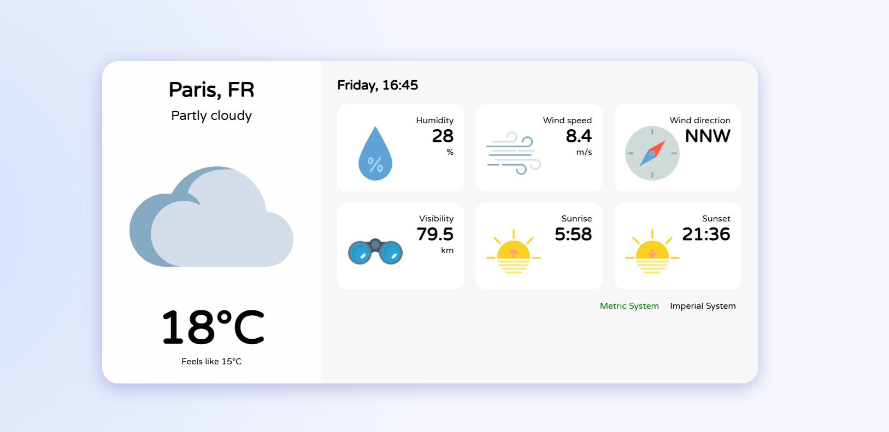

# Weather App

Application météo Next.js utilisant l’API Open-Meteo.



## Fonctionnalités

- Affichage de la météo actuelle d’une ville préconfigurée (pas de recherche front)
- Température, température ressentie, humidité, vent, visibilité, description, icône météo
- Lever et coucher du soleil, date et heure locale
- Changement d’unités (métrique/impérial)
- Rafraîchissement automatique
- Gestion des erreurs et affichage “N/A” si donnée manquante

## Configuration

La ville affichée est définie dans le fichier `config.json` à la racine du projet :

```json
{
  "city": "Paris",
  "country": "FR",
  "latitude": 48.8566,
  "longitude": 2.3522
}
```

Modifiez ces valeurs pour changer la ville affichée.

## Installation

1. Clonez le dépôt :
   ```sh
   git clone <votre-url-github>
   cd weather-app
   ```
2. Installez les dépendances :
   ```sh
   npm install
   ```
3. Lancez le serveur de développement :
   ```sh
   npm run dev
   ```
4. Ouvrez [http://localhost:3000](http://localhost:3000)

## API utilisée

- [Open-Meteo](https://open-meteo.com/) (aucune clé API requise)

## Personnalisation

- Les icônes météo sont dans `public/icons/`.
- Les conversions d’unités et le mapping météo sont dans `services/`.

## Licence

Projet sous licence [MIT](https://choosealicense.com/licenses/mit/).
